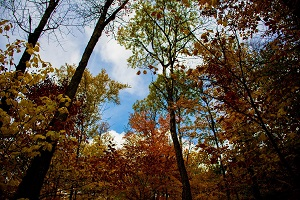
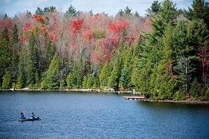
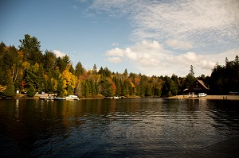
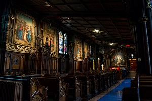
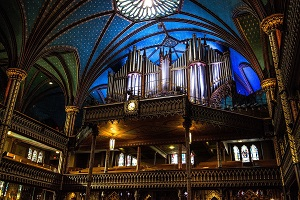

<link rel="stylesheet" type="text/css" media="all" href="custom.css" />

 Sneak Peek of Canada 

	

		

		Algonquin Provincial Park 
			
			
			
									 
		
		
		  	
		The East Canada Trip		 
		

			
			
		

		  
		

			
			
	

